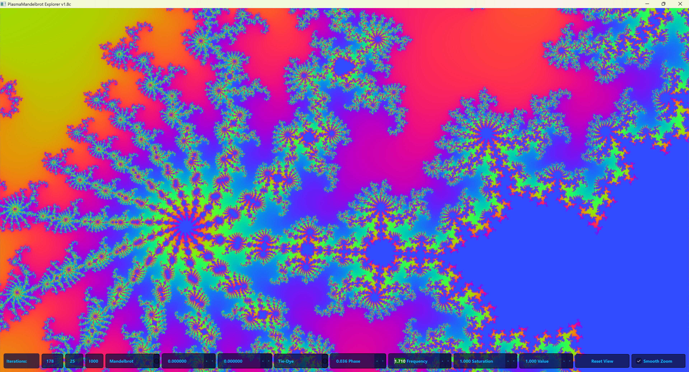

# Plasma mandelbrot



Plasma mandelbrot is a high-performance, modular fractal renderer featuring OpenCL acceleration and adaptive GL overlays. 

It has interactive realtime mouse navigation and zooming, psychedelic spectral color cycling and is determined to get you in the vibe, not only in the vibe I mean all out raving... in terms of computer science and programming.

See what I did there? 

Yeah I did most of this myself I swear!

## 🚀 Features
- **GPU Accelerated**: Leverages OpenCL for near-instant rendering of complex fractals.
- **Real-time Overlays**: Adaptive OpenGL overlays for interactive visualization.
- **Modular Architecture**: Easy-to-extend codebase with separated UI, math, and runtime layers.
- **Multiple Fractal Types**: Includes Mandelbrot, Julia, Newton, and Phoenix fractals.
- **Dynamic Colorization**: Advanced color gradients and post-processing kernels.

## 🛠️ Requirements
- Python 3.8+
- OpenCL-capable GPU (AMD, NVIDIA, or Intel)
- Dependencies: `pyopencl`, `PyQt5`, `numpy`

## 🚀 Quick Start
Plasma Mandelbrot features a "Smart Launcher" that handles both environment setup and application launch automatically.

### Windows
```powershell
./run.ps1
# OR
./run.bat
```

### Linux / macOS
```bash
chmod +x run.sh
./run.sh
```

The script will automatically create a virtual environment, install missing dependencies, and launch the viewer.

## 📐 Project Structure
- `math/`: OpenCL kernels (`.cl`) for fractal computation.
- `runtime/`: Core rendering logic, state management, and OpenCL setup.
- `ui/`: PyQt5 user interface components.

## 📄 License
This project is licensed under the MIT License. See `pyproject.toml` for details.
