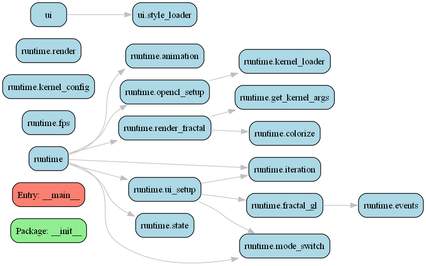

# Plasma Mandelbrot

**Plasma Mandelbrot** is a high-performance, modular fractal renderer featuring **OpenCL acceleration** and **adaptive GL overlays**. Designed with extensibility in mind, it allows for seamless addition of new fractal types and colorization algorithms.



## 🚀 Features
- **GPU Accelerated**: Leverages OpenCL for near-instant rendering of complex fractals.
- **Real-time Overlays**: Adaptive OpenGL overlays for interactive visualization.
- **Modular Architecture**: Easy-to-extend codebase with separated UI, math, and runtime layers.
- **Multiple Fractal Types**: Includes Mandelbrot, Julia, Newton, and Phoenix fractals.
- **Dynamic Colorization**: Advanced color gradients and post-processing kernels.

## 🛠️ Requirements
- Python 3.8+
- OpenCL-capable GPU (AMD, NVIDIA, or Intel)
- Dependencies: `pyopencl`, `PyQt5`, `numpy`

## 📦 Installation
Quickly set up your environment using the provided scripts:

### Windows (PowerShell)
```powershell
./install.ps1
```

### Linux / macOS (Bash)
```bash
chmod +x install.sh
./install.sh
```

## 🎮 Usage
Once the environment is set up, launch the application:

### Windows
You can use the PowerShell script or the classic CMD batch file:
```powershell
./PlasmaGPU.ps1
# OR
./PlasmaGPU.bat
```

### Linux / macOS
```bash
chmod +x PlasmaGPU.sh
./PlasmaGPU.sh
```

## 📐 Project Structure
- `math/`: OpenCL kernels (`.cl`) for fractal computation.
- `runtime/`: Core rendering logic, state management, and OpenCL setup.
- `ui/`: PyQt5 user interface components.

## 📄 License
This project is licensed under the MIT License. See `pyproject.toml` for details.
